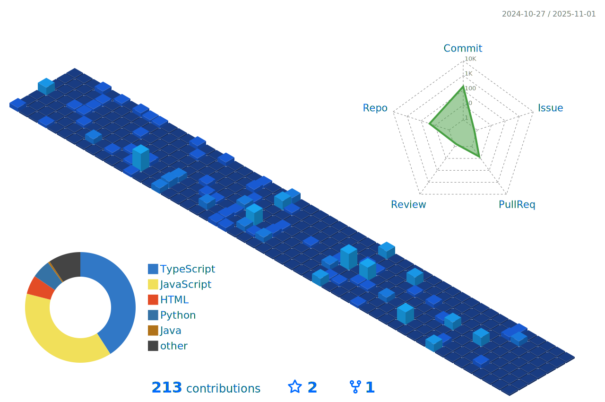

<div align="center">
<!--  -->

<!-- Header with animated typing effect -->
<!--  -->

<!-- Animated wave -->
<!--  -->

<!-- ###   Passionate Full Stack Developer from India 🇮🇳   -->


<!-- Profile counters with modern design -->
<!-- <p align="center">
  
  
  
</p> -->

<!-- Animated divider -->
<!-- Animated lightning -->
<!--  -->

<!-- Neon line -->
<!--  -->

<!-- Glowing line -->

</div>

##  About Me


```javascript
const aryan = {
    pronouns: "He/Him",
    location: "India 🇮🇳",
    role: "Full Stack Developer",
    passion: ["Web Development", "Problem Solving", "Learning New Tech","maintainable code"],
    currentFocus: "Building scalable web applications",
};
```

<div align="center">
<h2>Aryan's Stats</h2>
</div>

<br>

<p align="center">
   
</p>
<div align="center">
  
  
  
</div>




<!-- <div align="center">


</div> -->

---


##  Languages & Technologies

<div align="center">

### Programming Languages
<p>
    
</p>

### Frontend Development
<p>
    
</p>

### Backend Development
<p>
    
</p>

### Cloud & DevOps
<p>
    
</p>

### Tools & IDEs
<p>
    
</p>

</div>

---

##  Competitive Programming

<div align="center">

<!-- Enhanced CP Table -->
<table>
<tr>
<td align="center">

<br><strong>CodeChef</strong>
<br><a href="https://www.codechef.com/users/happy_dog_89">happy_dog_89</a>
<br>⭐⭐ 2 Stars
</td>
<td align="center">

<br><strong>Codeforces</strong>
<br><a href="https://codeforces.com/profile/willgaxxx">willgaxXx</a>
<br>🚀 Upcoming Expert
</td>
<td align="center">

<br><strong>LeetCode</strong>
<br><a href="https://www.leetcode.com/aryanx16">aryanx16</a>
<br>🔥 Active Solver
</td>
</tr>
</table>

</div>


<!-- ##   -->
## Connect With Me

<p align="center">
  <a href="https://github.com/aryanx16" target="_blank">
    
  </a>
  <a href="https://www.linkedin.com/in/aryan-babare-49bb24298/" target="_blank">
    
  </a>
  <a href="https://babare.site" target="_blank">
    
  </a>
  <a href="mailto:aryanbabare1@gmail.com" target="_blank">
    
  </a>
</p>


---

<div align="center">

###  Thanks for Visiting!

<!-- Animated footer -->


</div>
